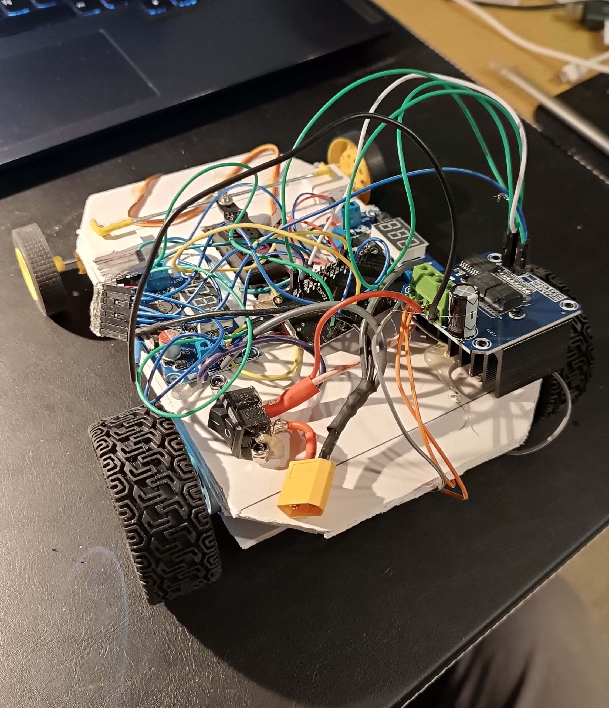
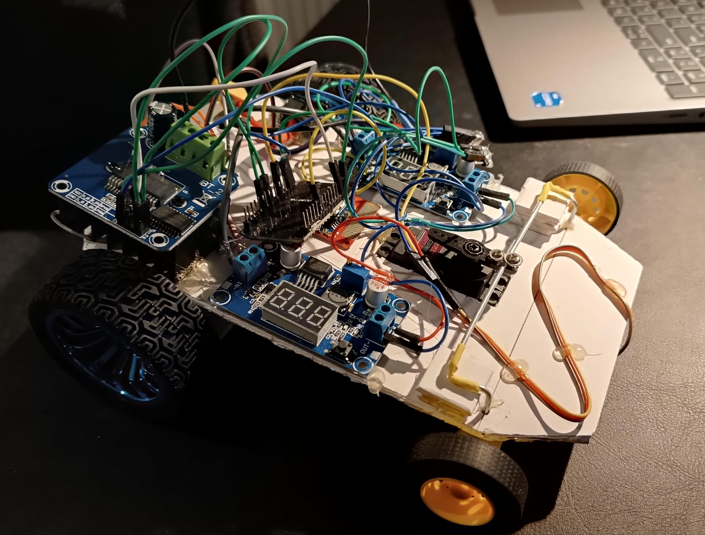

# RC Car ESP32 - Open-Smart Wireless Control

This project is an ESP32-based remote-controlled car using the Open-Smart Wireless Joystick (315/433MHz) and the BTS7960 43A High-Power motor driver.

## System Architecture

### 1. Signal Decoding (OpenSmartDecoder)
The core decoder library located in [OpenSmartDecoder](file:///mnt/arch_storage/Dokumenty/Projekty/esp32_rc_car/rc_car/lib/OpenSmartDecoder) is a **custom, hand-crafted decoding alg** developed completely from scratch to process signals from the Open-Smart Wireless Joystick without relying on bloated, generic library wrappers.

#### How it works:
* **Edge Timing**: It captures state changes of the receiver pin and measures signal pulse durations using `micros()`, normalizing pulse widths into discrete logical bit periods (nominally 500µs).
* **Sync Acquisition**: A shift register scans the raw bitstream to match a custom synchronization pattern (`0xb38`) signifying the start of a transmission frame.
* **Custom 6b/4b Line Code Decoding**: To improve communication reliability, 8-bit bytes are transmitted over the air as 12-bit sequences split into two 6-bit symbols. The decoder maps these 6-bit patterns back to 4-bit nibbles using a custom translation table.
* **Payload Verification**: Once synchronized, the library parses the packet size, validates the transmission preamble (`0x7E`), and extracts 10-bit analog joystick coordinates ($X$/$Y$) and digital button states.

### 2. Control Logic (main.cpp)
- Steering: Servo-based steering on the front axle.
- Drive: BTS7960 driver controlling two RS390 rear motors in parallel.

## Media & Gallery

Here are the images and a video demonstration of the assembled vehicle (stored in the [materials/](file:///mnt/arch_storage/Dokumenty/Projekty/esp32_rc_car/materials) folder):

### Video Demonstration
* [Watch the RC Car Demonstration Video](materials/vid1.mp4)

## Pin Configuration (ESP32)

| Function | ESP32 Pin | BTS7960 Pin |
| :--- | :--- | :--- |
| **RX (Radio)** | 19 | - |
| **Servo (Steering)** | 14 | - |
| **Forward PWM** | 25 | RPWM |
| **Reverse PWM** | 26 | LPWM |
| **Driver Enable** | 15 | R_EN + L_EN |

## Motor Driver: BTS7960 (43A)
The transition to BTS7960 was necessary to handle the high current requirements of the RS390 motors when powered by a 3S (12V) battery.
- Logic VCC: 5V (from ESP32)
- Common GND: Connect ESP32 ground and Battery ground.
- Power: Connect 12V Battery to B+ and B-.

## License
This project is licensed under the Creative Commons Attribution 4.0 International (CC BY 4.0) license.
